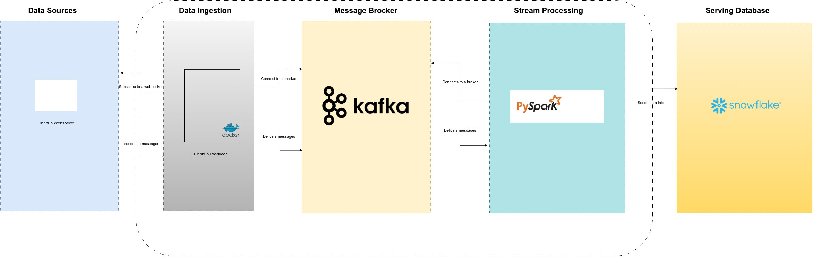

# Data2Bots Intermediate Class Capstone Project
#  FinnHub>Kafka>Spark>Snowflake


## Project Overview
An End to End Data Engineering Project getting Data from a Data Source, ingesting Said Data in dockerised applications, using Kafka to broadcast output messages , streaming the data using Pyspark and housing the data in a Snowflake table

This project is the intermediate Module Project submitted to the Data2Bots academy for cohort 01.
This project will demonstrate the use of streaming pipeline development and architecture emphasizing the respective aspects of pipeline design in low latency, scalability & availability.

The system design is a data pipeline streaming real-time trades for US stocks, forex and crypto from the Finnhub website api. 

Data is initially obtained using websockets from the Finnhub API. The data obtained using the Finnhub API websockets is converted into avro format and streamed via Kafka.

The avro serialized data is deserialized by Pyspark and transformation is applied to the data. The transformed data is then streamed in micro batches to Snowflake where it is used to populate Snowflake tables.

## Data Pipeline Architecture
The diagram above is the schematic diagram depicting the pipeline's architecture/layering.

All applications are containerized into Docker containers.

**Data ingestion layer** – A containerized Python application called FinnhubProducer connects to Finnhub.io websocket. The application retrieves trade data via websocket and encodes the data into Avro format as specified by the schema contained in the trades.avsc file. This data is ingested by the Kafka broker.

**Message broker layer** - messages from FinnhubProducer are consumed by the Kafka broker. “./kafka/scripts/kafka_create_topic.sh” script is initiated at the kafka container startup, this script creates the required topic used to stream the data. The Zookeeper container is launched before Kafka as it is required for its metadata management.

**Stream processing layer** - a Spark docker container is initiated for processing of the data from Kafka. A PySpark application called SparkX is submitted into Spark cluster manager via local mode, the setup can be extended/scaled via docker containers to use cluster mode that can delegate worker(s) for more intensive applications. This application connects to the Kafka broker to retrieve messages, transform them using Spark Structured Streaming, and loads into Snowflake tables. 
The first query is used to transform the trades data into a dataframe which is streamed continuously into snowflake while the second query aggregates the data and streams the data using a timed trigger

**Serving database layer** - a Snowflake database stores & persists data for the two queries from the Spark application. 

## Tech. Stack
•	[Github](https://github.com/): To host our source code as well as for CI/CD with Github Actions

•	[Docker](https://www.docker.com/): To containerize our code

•	[Kafka](https://kafka.apache.org/):  used to build real-time streaming data pipelines and applications that adapt to the data streams.

•	[Spark](https://spark.apache.org/docs/latest/quick-start.html): used for fast, interactive computation that runs in memory, used here specifically for data processing (data transformation step), Spark is chosen because of its parellel processing capabilities. Should the amount of data proliferate to 100x, more worker nodes can be added to the spark cluster to scale out.

•	[Snowflake](https://www.snowflake.com/en/): used for data storage, processing, and analytic solutions 

## Project Requirement/Setup
Required data for running the finnhub producer, kafka and snowflake connections are listed below. This data is required to run the pipeline. The data is required to be written in an .env file placed at the root folder. A config server like AWS Parameter Store, Google Secrets Manager, HashiCorp Vault or GitHub secrets can also be used as an alternative  for storing the secrets/config data.
Pem public and private keys need to be also generated for programmatic access to the Snowflake user account.

## SECRETS
|Secret Variable Name       |Variable Description                                           |
|:--------------------------|:--------------------------------------------------------------|
|**FINNHUB SECRETS**                                                                           |
|d2b_finnhubio_user_name    |#user name used when registering a finnhub account             |
|d2b_finnhubio_user_email   |#user email used when registering a finnhub account            |
|d2b_token_finnhubio	    |#user token provided by finnhub on registering finnhub account |
|d2b_tickers_finnhubio	    |#List of Trading pairs to obtain data for i.e['BINANCE:BTCUSDT', 'BINANCE:ETHUSDT', 'BINANCE:XRPUSDT', 'BINANCE:DOGEUSDT' ]|
|**KAFKA SECRETS**                                                                             |
|d2b_kafka_server|          |#name of  client/listener in kafka docker container i.e. localhost or broker|
|d2b_kafka_port	            |#Kafka server port used for listening for streamed data        |
|d2b_kafka_producer_topic   |#kafka topic used for streamed data                            |
|**SNOWFLAKE SECRETS**                                                                         |	
|sf_account                 |Snowflake account identifier i.e. 'vbctxic-tq01322'            |
|sf_url                     |url of snowflake account i.e. 'https://vbctxic-tq01322.snowflakecomputing.com/' |
|sf_database                |	Snowflake Database Name                                     |
|sf_warehouse               | 	Snowflake Warehouse Name                                    |                                   
|sf_schema                  |	Snowflake Schema Name                                       |
|sf_table_detailedDFX       |	Snowflake table for detailed reporting                      |
|sf_table_finalSummaryDFX   | 	Snowflake table for summary reporting                       |    
|sf_int_stage               | 	Snowflake temporary stage                                   |
|sf_role                    |	Snowflake Role                                              |    
|sf_username                |	Snowflake user name                                         |
|sf_password                |	Snowflake user password                                     |    
|sf_pem_pass                |	Password key for encrypted snowflake pem file               |    

## Pipeline Initiation Steps
Once containers have been initialized, the following commands need to be executed in the correct order to start the pipeline. This commands can also be found in the unix (linux) shell executables files in the “./scripts” folder
### KAFKA 
**start kafka server:**
```
docker exec -it broker bash /bin/kafka-server-start /etc/kafka/server.properties
```

**start producer for existing topic trades:**

```
docker exec -it broker bash /bin/kafka-console-producer --topic trades --bootstrap-server broker:29092
```

**run consumer:**
```
docker exec -it broker bash /bin/kafka-console-consumer --topic trades --bootstrap-server broker:29092 
```

### FINNHUB PRODUCER
**run the finnhub producer python application:**
```
docker exec -it producer python ./producer.py
```

### SPARK
**initiate the pyspark applicatinon:**
```
docker-compose exec sparkm spark-submit --master spark://172.18.0.5:7077 --packages org.apache.spark:spark-sql-kafka-0-10_2.12:3.4.0,org.apache.spark:spark-avro_2.12:3.4.0,net.snowflake:spark-snowflake_2.12:2.13.0-spark_3.4 /opt/spark-app/sparkx.py
```

## Future Improvements
**CLOUD DEPLOYMENT**

The pipeline can also be deployed on the cloud and its infrastructure can also be managed via terraform

**SCALING UP**

We can use a spark cluster instead of running the spark application in local mode, we can also increase the number of worker nodes on the spark cluster, to improve performance of compute.

**ADDITION OF VISUALIZATION LAYER**

A Visualization layer using visualization softwares i.e. Grafana, OpenSearch, PowerBI or tablaeau can be connected to the Snowflake database and used to serve visualized data to users in the form of a dashboard. The dashboard can be refreshed as specified by the user.

**DEVELOPING CI/CD PIPELINE/TESTING**

The program can be further improved using Kubernetes and terraform, pipeline testing would also be a desirable improvement before deploying pipeline to the cloud
**DEPLOYMENT OF KAFKA AS STATEFULSETS**

Kafka is currently configured to be a standard local deployments. However, implementing kafka as StatefulSets in kubernetics would be desired in order to improve its scalability and reliability at scale.

**SUPPORT FOR DIFFERENT ENVIRONMENTS**

Support can also be added for different environments i.e. development, staging, production

**OTHER DATA SOURCES**

The possibility of using other ticker/trade data sources apart from finnhub can also be considered
